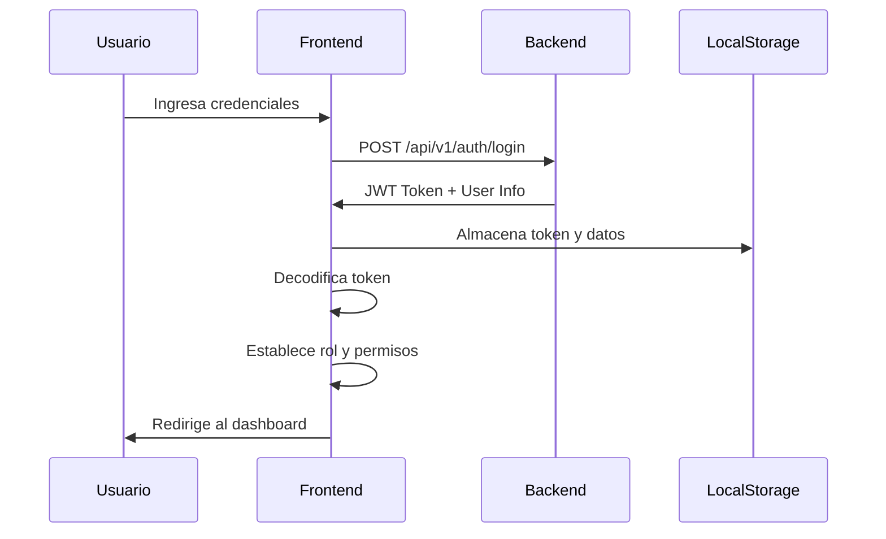
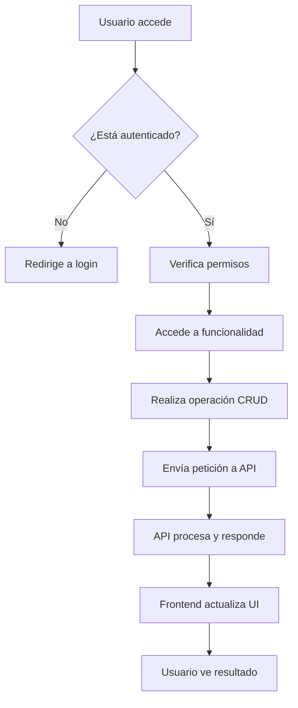

# 🚀 Digital Frontend - Sistema de Gestión Digital

## 📋 Descripción General

**Digital Frontend** es una aplicación web desarrollada en **Angular 20** que proporciona un sistema completo de gestión para clientes, colaboradores, usuarios y solicitudes. La aplicación se conecta a una API Java backend que ejecuta en el puerto 8080 y utiliza autenticación JWT para la seguridad.

## 🎯 Características Principales

### 🔐 Autenticación y Autorización
- **Sistema de Login** con validación de formularios
- **Autenticación JWT** con tokens almacenados en localStorage
- **Control de acceso basado en roles** (ADMIN, CLIENTE, COLABORADOR)
- **Guard de autenticación** para proteger rutas
- **Interceptor HTTP** para incluir tokens en todas las peticiones

### 🎨 Interfaz de Usuario
- **Diseño moderno** con Bootstrap 5 y FontAwesome
- **Sidebar colapsible** con gradiente violeta-naranja
- **Responsive design** para dispositivos móviles y desktop
- **Iconografía intuitiva** para mejor experiencia de usuario
- **Modales interactivos** para confirmaciones y edición

## 🏗️ Arquitectura del Proyecto

### 📁 Estructura de Directorios

```
src/
├── app/
│   ├── components/           # Componentes principales
│   │   ├── login/           # Página de autenticación
│   │   └── dashboard/       # Dashboard principal con sidebar
│   │       └── home/        # Página de bienvenida
│   ├── core/                # Funcionalidades core
│   │   ├── guards/          # Guards de autenticación
│   │   ├── interceptors/    # Interceptores HTTP
│   │   └── services/        # Servicios core
│   ├── features/            # Módulos de funcionalidad
│   │   ├── auth/            # Autenticación
│   │   └── dashboard/       # Funcionalidades del dashboard
│   │       ├── components/  # Componentes CRUD
│   │       └── services/    # Servicios de API
│   ├── models/              # Interfaces y modelos
│   ├── services/            # Servicios globales
│   └── shared/              # Componentes compartidos
```

## 🔧 Funcionalidades por Módulo

### 👥 Gestión de Clientes
- **Listar todos los clientes** 📋
- **Buscar cliente por ID** 🔍
- **Registrar nuevo cliente** ➕
- **Editar información del cliente** ✏️
- **Eliminar cliente** 🗑️

**Campos del cliente:**
- ID (automático)
- Nombre
- Apellido
- Email
- Teléfono
- Área/Departamento

### 👨‍💼 Gestión de Colaboradores
- **Listar todos los colaboradores** 📋
- **Buscar colaborador por ID** 🔍
- **Registrar nuevo colaborador** ➕
- **Editar información del colaborador** ✏️
- **Eliminar colaborador** 🗑️

**Campos del colaborador:**
- ID (automático)
- Nombre
- Apellido
- Teléfono
- Especialidad
- Rating promedio
- Tickets resueltos

### 👤 Gestión de Usuarios
- **Listar todos los usuarios** 📋
- **Registrar nuevo usuario** ➕
- **Editar información del usuario** ✏️
- **Eliminar usuario** 🗑️

**Características especiales:**
- **Tipos de cuenta:** Independiente, Asociado a Cliente, Asociado a Colaborador
- **Roles:** ADMIN, CLIENTE, COLABORADOR
- **Contraseñas encriptadas** 🔒
- **Asociación automática** con clientes o colaboradores

### 📝 Gestión de Solicitudes
- **Listar solicitudes** 📋
- **Registrar nueva solicitud** ➕
- **Editar solicitud** ✏️
- **Eliminar solicitud** 🗑️

**Campos de la solicitud:**
- ID (automático)
- Título
- Descripción
- Estado
- Prioridad
- Cliente ID
- Colaborador ID (opcional)
- Fechas de creación, actualización y cierre

## 🔐 Sistema de Roles y Permisos

### 👑 Administrador (ADMIN)
- **Acceso completo** a todas las funcionalidades
- **Gestión de clientes, colaboradores y usuarios**
- **Visualización de todas las solicitudes**
- **Creación de solicitudes para cualquier cliente**

### 👤 Cliente (CLIENTE)
- **Acceso limitado** a funcionalidades específicas
- **Visualización de sus propias solicitudes**
- **Creación de solicitudes** (asignación automática de cliente_id)
- **Sin acceso** a gestión de usuarios

### 👨‍💼 Colaborador (COLABORADOR)
- **Acceso a solicitudes** asignadas
- **Sin acceso** a gestión de usuarios
- **Funcionalidades limitadas** según su rol

## 🛠️ Tecnologías Utilizadas

### Frontend
- **Angular 20** - Framework principal
- **TypeScript** - Lenguaje de programación
- **Bootstrap 5** - Framework CSS
- **FontAwesome** - Iconografía
- **RxJS** - Programación reactiva

### Backend (API)
- **Java** - Lenguaje del servidor
- **Puerto 8080** - Servidor de desarrollo
- **JWT** - Autenticación por tokens
- **REST API** - Comunicación HTTP

### Herramientas de Desarrollo
- **Angular CLI** - Herramientas de línea de comandos
- **npm** - Gestor de paquetes
- **Git** - Control de versiones

## 🚀 Instalación y Configuración

### Prerrequisitos
- Node.js (versión 18 o superior)
- npm (incluido con Node.js)
- Angular CLI (`npm install -g @angular/cli`)

### Pasos de Instalación

1. **Clonar el repositorio**
```bash
git clone <repository-url>
cd digital-frontend
```

2. **Instalar dependencias**
```bash
npm install
```

3. **Configurar el backend**
- Asegurarse de que la API Java esté ejecutándose en `http://localhost:8080`
- Verificar que los endpoints de autenticación estén disponibles

4. **Ejecutar la aplicación**
```bash
ng serve
```

5. **Abrir en el navegador**
```
http://localhost:4200
```

## 📊 Flujo de Autenticación



## 🔄 Flujo de CRUD



## 🎨 Características de UI/UX

### 🎯 Diseño Responsivo
- **Mobile-first** approach
- **Sidebar colapsible** en dispositivos móviles
- **Tablas adaptativas** con scroll horizontal
- **Modales centrados** para mejor experiencia

### 🎨 Paleta de Colores
- **Gradiente principal:** Violeta (#a259f7) a Naranja (#f7b32b)
- **Colores de estado:** Verde (éxito), Rojo (error), Amarillo (advertencia)
- **Fondo:** Blanco y grises claros para mejor legibilidad

### 🔧 Componentes Interactivos
- **Botones con iconos** FontAwesome
- **Formularios validados** en tiempo real
- **Modales de confirmación** para acciones destructivas
- **Mensajes de feedback** para todas las operaciones

## 🔒 Seguridad

### 🛡️ Medidas Implementadas
- **Autenticación JWT** con tokens seguros
- **Guards de ruta** para proteger páginas
- **Interceptor HTTP** para incluir tokens automáticamente
- **Validación de formularios** en frontend y backend
- **Manejo seguro de contraseñas**

### 🔐 Almacenamiento Seguro
- **Tokens JWT** en localStorage
- **Información de usuario** encriptada
- **Logout automático** al cerrar sesión
- **Limpieza de datos** al cerrar sesión

## 📱 Funcionalidades por Dispositivo

### 🖥️ Desktop
- **Sidebar fijo** con navegación completa
- **Tablas completas** con todas las columnas
- **Modales grandes** para mejor visualización

### 📱 Mobile
- **Sidebar colapsible** con botón de toggle
- **Tablas con scroll** horizontal
- **Modales adaptados** al tamaño de pantalla
- **Navegación optimizada** para touch

## 🚀 Comandos Útiles

### Desarrollo
```bash
ng serve              # Servidor de desarrollo
ng build              # Construir para producción
ng test               # Ejecutar tests
ng lint               # Verificar código
```

### Generación de Componentes
```bash
ng generate component nombre-componente
ng generate service nombre-servicio
ng generate guard nombre-guard
```

## 📈 Estado del Proyecto

### ✅ Funcionalidades Completadas
- [x] Sistema de autenticación JWT
- [x] Dashboard con sidebar responsive
- [x] CRUD completo para Clientes
- [x] CRUD completo para Colaboradores
- [x] CRUD completo para Usuarios
- [x] CRUD completo para Solicitudes
- [x] Control de acceso por roles
- [x] Interfaz responsive
- [x] Validación de formularios
- [x] Manejo de errores

### 🔄 Funcionalidades en Desarrollo
- [ ] Búsqueda avanzada de usuarios
- [ ] Filtros y paginación en tablas
- [ ] Exportación de datos
- [ ] Notificaciones en tiempo real
- [ ] Dashboard con estadísticas

### 📋 Funcionalidades Planificadas
- [ ] Sistema de notificaciones push
- [ ] Reportes y analytics
- [ ] Integración con sistemas externos
- [ ] Modo oscuro
- [ ] Internacionalización (i18n)

## 🤝 Contribución

### 📝 Guías de Contribución
1. **Fork** el repositorio
2. **Crea** una rama para tu feature (`git checkout -b feature/nueva-funcionalidad`)
3. **Commit** tus cambios (`git commit -am 'Agrega nueva funcionalidad'`)
4. **Push** a la rama (`git push origin feature/nueva-funcionalidad`)
5. **Crea** un Pull Request

### 🎯 Estándares de Código
- **TypeScript** con tipos estrictos
- **Angular Style Guide** para estructura
- **Bootstrap** para estilos
- **FontAwesome** para iconos
- **RxJS** para programación reactiva

## 📞 Soporte

### 🐛 Reportar Bugs
- Usar el sistema de issues de GitHub
- Incluir pasos para reproducir el error
- Adjuntar capturas de pantalla si es necesario
- Especificar versión del navegador y sistema operativo

### 💡 Solicitar Features
- Describir la funcionalidad deseada
- Explicar el caso de uso
- Proponer implementación si es posible
- Considerar impacto en usuarios existentes

## 📄 Licencia

Este proyecto está bajo la licencia MIT. Ver el archivo `LICENSE` para más detalles.

---

**Desarrollado con ❤️ usando Angular 20**
